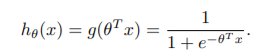
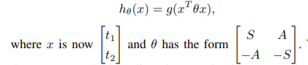
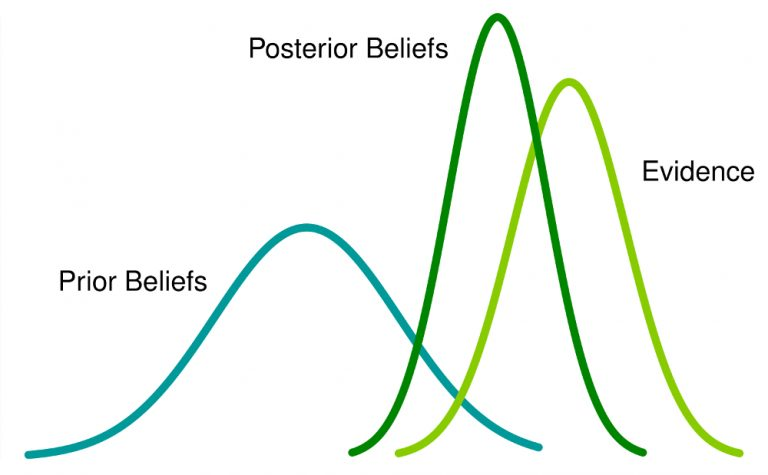

# NBA Data Analysis

.... Pranav

### Results of games

... Nishant

#### Box Score

... Nishant

### Synergy

In Basketball, player-player chemistry plays a big role in predicting the output of the games. Here, the motivation of this model is to understand the role that player-player chemistry (synergy) may play in predicting game outcomes and providing quantitative predictions of chemistry between players. 

The inputs for our algorithm will be the identity of the players on each team for a given game. We will then use logistic regression with a linear model and a quadratic.

model to output a prediction on which team will win the match. We also provide a comparison using a multi-layer perceptron neural net.

**Linear Model**

**Quadratic Model**

We’ll also take a look at the learned parameters of the quadratic model which will give us quantitative parameters to compare the chemistry of the players. 

The feature vector for every team would have a length of total number of players. It would have 1s in positions corresponding to its players and 0s elsewhere. Using this as input to our quadratic model we get two matrices **S** and **A**. 

*   Diagonal elements of S - indicator of player’s individual skill 
*   Off-diagonal elements of S - indicator of how much the two players as teammates contribute positively to the win percentage of their team 
*   Off-diagonal elements of A - indicator of the difference in the players’ contribution to their teams’ winning chance when they are on opposing teams

These are very important parameters. Using these we can calculate how well would any two players fit together. Players i and j would fit together well if the value of **S**[i][j] is high and **A**[i][j] is low.

This work has a lot of potential as it can effectively predict which players should be paired together. Also, it can predict successful transfers and trades. But there are some drawbacks such as we have to include age as a factor. Also it doesn’t account for new players. Nevertheless, this has a lot of scope and can be explored further.

### Generating Line ups

**LightGBM**

Gradient boosting refers to a class of ensemble machine learning algorithms that can be used for classification or regression predictive modeling problems.

Ensembles are constructed from decision tree models. Trees are added one at a time to the ensemble and fit to correct the prediction errors made by prior models. This is a type of ensemble machine learning model referred to as boosting.

Models are fit using any arbitrary differentiable loss function and gradient descent optimization algorithm. This gives the technique its name, “gradient boosting,” as the loss gradient is minimized as the model is fit, much like a neural network.

LightGBM is a gradient boosting framework that uses a tree based learning algorithm. It extends the gradient boosting algorithm by adding a type of automatic feature selection as well as focusing on boosting examples with larger gradients. It is widely used in cases of tabular data for regression and classification.

LightGBM is prefixed as ‘Light’ because of its high speed. Light GBM can handle the large size of data and takes lower memory to run. Tble his is suitable as the number of records in the dataset is about 1.2 lakhs. Another reason of why Light GBM is popular is because it focuses on accuracy of results.

Since it is based on decision tree algorithms, it splits the tree leaf wise with the best fit whereas other boosting algorithms split the tree depth wise or level wise rather than leaf-wise. So when growing on the same leaf in Light GBM, the leaf-wise algorithm can reduce more loss than the level-wise algorithm and hence results in much better accuracy which can rarely be achieved by any of the existing boosting algorithms.

### Bayesian Opt

**Bayesian Optimization** is a probabilistic model based approach for finding the minimum of any function that returns a real-value metric. It is very effective with real-world applications in high-dimensional parameter-tuning for complex machine learning algorithms. Bayesian optimization utilizes the Bayesian technique of setting a prior over the objective function and combining it with evidence to get a posterior function.

Hyperparameter tuning by Bayesian Optimization of machine learning models is more efficient than Grid Search and Random Search. Bayesian Optimization has better overall performance on the test data and takes less time for optimization. 

NN Pranav

GA Prajna

### Expert Opinion

... Prajna
